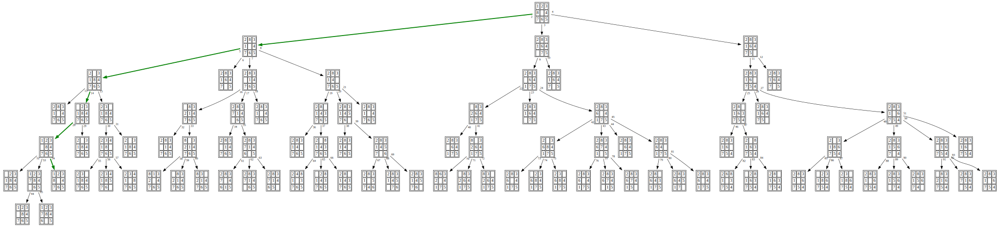

# n-puzzle
`n-puzzle` solves the ["n puzzles"](https://en.wikipedia.org/wiki/15_puzzle), and is intended to showcase various searching algorithms.

# Building
Clone this repository. Run `make`.

`n-puzzle` depends on [readline](https://tiswww.case.edu/php/chet/readline/rltop.html) to receive inputs, so make sure it's installed on your machine.

# Usage
Invoke `n-puzzle` with `-h` to see its usage and find out what algorithms are available.

```
usage: ./n-puzzle [-a bfs/dfs/...] [-o output_file]  [-h]
```

On startup, the program will ask for the initial state and the goal of the puzzle.
Note that coordinates `i`(row) and `j`(column) starts at 0 and is counted from the top-left position.
Use whatever integer at the unoccupied position when entering the states.

Once the chosen algorithm terminates,
`n-puzzle` checks that the problem is solved by applying the answer to the initial state.
It prints out a series of arrow emojis corresponding to the sequence of directions that in order to solve the puzzle,
the **unoccupied** position needs to be moved in, one tile at a time, by moving a surrounding tile.

Additionally, `n-puzzle` can help generate a visual representation of the resulting search tree,
if a file name is provided with the `-o` option.
The output file is in the [dot](https://graphviz.org/doc/info/lang.html) format,
which can later be used by [Graphviz](https://graphviz.org/) to generate an image of the tree.

# Example
Save the following input as `input.txt`.
```
3
2 8 3
1 6 4
7 0 5
2 1
1 2 3
8 0 4
7 6 5
1 1
```

Run `n-puzzle` on it with [breath-first search](https://en.wikipedia.org/wiki/Breadth-first_search), and generate `bfs.dot`.
```
./n-puzzle -a bfs -o bfs.dot < ./input.txt
```

```
Size: 3
Initial state: 2 8 3
Initial state: 1 6 4
Initial state: 7 0 5
Unoccupied position i j: 2 1
Goal: 1 2 3
Goal: 8 0 4
Goal: 7 6 5
Unoccupied position i j: 1 1
⬆️ ⬆️ ⬅️ ⬇️ ➡️
```

Generate `bfs.svg` using `dot` (assuming Graphviz is installed):
```
dot bfs.dot -Tsvg > bfs.svg
```
View the result with, for example, your web browser.


Alternatively, if you don't want to or can't install Graphviz, copy the content of `bfs.svg` and paste it in [an online visual editor](http://magjac.com/graphviz-visual-editor/) to view the tree.
